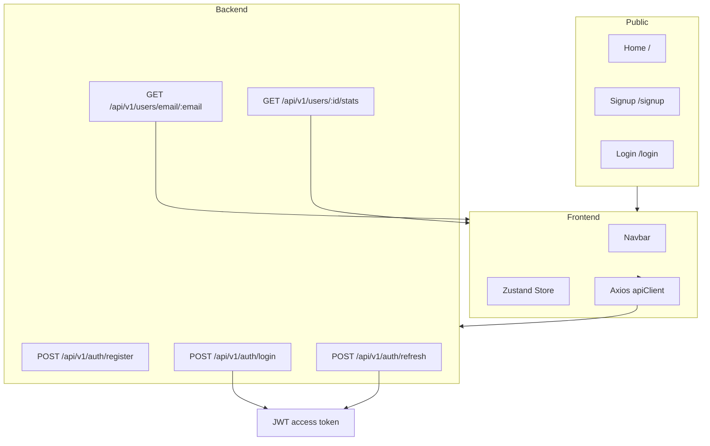

# Auth App — Spring Boot + React (Vite)

Clean, minimal, and secure authentication starter application.

Built by Rahul — this repository contains two projects:

- `auth-backend` — Spring Boot (Java 17) authentication & user service
- `auth-front` — React + TypeScript + Vite frontend

---

## Highlights

- Email/password registration and JWT-based login
- Refresh-token rotation stored server-side (HTTP-only cookie)
- Google & GitHub OAuth2 sign-in (handled by backend)
- Protected frontend dashboard and profile pages
- Simple, extendable code structure for production-ready auth

---

## Quick Start

Prerequisites: Java 17, Maven, Node 16+ (npm), MySQL (optional for local DB).

Backend (dev):

```powershell
cd auth-backend
mvnw.cmd spring-boot:run    # Windows
# or on Unix: ./mvnw spring-boot:run
```

Frontend (dev):

```bash
cd auth-front
npm install
npm run dev
```

By default the backend listens on `http://localhost:8083` and the frontend on `http://localhost:5173`.

---

## Badges & Demo


Demo (placeholder):


---

## Table Of Contents

- [Highlights](#highlights)
- [Quick Start](#quick-start)
- [Project Flow](#project-flow)
- [GitHub Workflow (CI)](#github-workflow-ci)
- [Important Endpoints](#important-endpoints)
- [Recent changes (2026-05-26)](#recent-changes-2026-05-26)

---

## Project Flow

Compact, GitHub-friendly flow (no curly braces in node labels so Mermaid renders correctly on GitHub):



---

## GitHub Workflow (CI)

You can enable a simple CI pipeline to run backend and frontend checks on PRs. Example steps for `.github/workflows/ci.yml`:

1. Checkout repository
2. Set up JDK 17 and run `./mvnw -DskipTests=false test`
3. Set up Node.js and run `npm ci && npm run build`
4. Optionally run ESLint and unit tests

Example badge to add after creating the workflow:

```
[](https://github.com/Rahul-18r/Sprin-Auth-webApp/actions)
```

---

## Architecture (short)

- Frontend holds the short-lived access token in memory and user profile in a Zustand store.
- Refresh tokens are persisted to the DB and rotated by the backend; the refresh token itself is sent as an HTTP-only cookie.
- Backend validates JWT access tokens on each request using a `JwtAuthenticationFilter` and enforces method/security rules via Spring Security.

---

## Important Endpoints

Auth:

- `POST /api/v1/auth/register` — register new user
- `POST /api/v1/auth/login` — login (email/password)
- `POST /api/v1/auth/refresh` — rotate refresh token and issue new access token
- `POST /api/v1/auth/logout` — revoke refresh token and clear cookie

User / Dashboard:

- `GET /api/v1/users/email/:email` — fetch user profile by email
- `GET /api/v1/users/{userId}/stats` — (new) returns JSON with `totalLogins`, `securityScore`, `activeSessions` (authenticated users can fetch their own stats)

Admin:

- `GET /api/v1/users` — list users (admin)
- `PUT /api/v1/users/{userId}` — update user (admin)
- `DELETE /api/v1/users/{userId}` — delete user (admin)

---

## Recent changes (2026-05-26)

- Added backend endpoint `GET /api/v1/users/{userId}/stats` and corresponding `UserStats` DTO.
- Implemented service logic that counts refresh tokens for `totalLogins` and `activeSessions` and provides a basic `securityScore` heuristic.
- Frontend now calls `getUserStats` and renders dynamic dashboard tiles (see `auth-front/src/pages/users/Userhome.tsx`).
- Updated security config to allow authenticated users to fetch their own stats while keeping admin routes protected.

---

## Developer Notes

- The mermaid diagram in older READMEs used braces in node labels which can break some renderers — preferred style is `:param` or plain text labels.
- If you encounter `403 Forbidden` calling the stats endpoint, ensure:
  1. The backend is running on `http://localhost:8083`.
 2. The frontend user is signed in and the access token is available.

---

## Where to look

- Backend main files: `auth-backend/src/main/java/...` — `SecurityConfig`, `AuthController`, `JwtAuthenticationFilter`, `OAuth2SuccessHandler`.
- Frontend main files: `auth-front/src` — `services/AuthService.ts`, `pages/users/Userhome.tsx`, `config/apiClient.ts`.

---

If you want, I can add a repository badge, a short demo GIF, or a separate `CONTRIBUTING.md`. Which would you prefer next?
