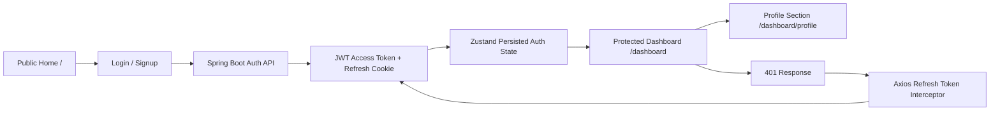

# Auth App

## Author

Rahul

## Overview

This is a full-stack authentication app with a React + Vite frontend and a Spring Boot backend. It supports email/password registration and login, Google and GitHub OAuth2 login, JWT-based sessions, token refresh, and a protected dashboard with a profile section.

The repository is split into two apps:

* [auth-backend](auth-backend)
* [auth-front](auth-front)

## Tech Stack

### Frontend

* React 19
* Vite
* TypeScript
* React Router
* Zustand
* Axios
* Framer Motion
* Tailwind CSS and shadcn/ui components

### Backend

* Spring Boot 3
* Spring Security
* Spring Data JPA
* JWT access and refresh tokens
* OAuth2 login with Google and GitHub
* MySQL

## Actual Project Flow



### 1. Public entry

The app opens on the landing page at `/`, which renders the futuristic home page. The navbar changes based on whether the user is logged in.

### 2. Registration

The signup page at `/signup` collects name, email, and password. It calls `POST /api/v1/auth/register` and then sends the user to `/login`.

### 3. Login

The login page at `/login` supports:

* email/password login
* Google OAuth2 login
* GitHub OAuth2 login

Email/password login calls `POST /api/v1/auth/login`. On success, the backend returns:

* access token
* refresh token
* user data

The frontend stores the auth state in Zustand and persists it under `app_state`.

### 4. Auth state and request handling

The frontend uses an Axios client with interceptors:

* every request sends the access token as `Authorization: Bearer ...`
* if the server returns `401`, the client automatically calls `POST /api/v1/auth/refresh`
* after refresh, the new token and user data replace the old auth state

### 5. Protected dashboard

The `/dashboard` route is guarded by `Userlayout`. If the user is not logged in, they are redirected to `/login`.

The dashboard contains:

* `/dashboard` - overview page
* `/dashboard/profile` - profile section

### 6. Profile section

The profile page shows the logged-in user's:

* full name
* email
* provider
* enabled status

It also includes UI actions for:

* changing the profile picture
* editing profile fields
* changing password
* deleting the account

The edit and save controls are currently UI-driven and can be connected to backend update endpoints later.

### 7. Logout

Logout calls `POST /api/v1/auth/logout`, clears the refresh cookie on the backend, and removes the stored auth state on the frontend.

## Frontend Routes

| Route | Screen | Notes |
| --- | --- | --- |
| `/` | Home | Public landing page |
| `/login` | Login | Email/password + OAuth buttons |
| `/signup` | Signup | User registration |
| `/about` | About | Public info page |
| `/services` | Services | Public info page |
| `/dashboard` | Dashboard | Protected overview |
| `/dashboard/profile` | Profile | Protected profile section |
| `/oauth/success` | OAuth success | OAuth callback success screen |
| `/oauth/failure` | OAuth failure | OAuth callback failure screen |

## Backend API Endpoints

| Method | Endpoint | Purpose |
| --- | --- | --- |
| `POST` | `/api/v1/auth/register` | Register a new user |
| `POST` | `/api/v1/auth/login` | Login with email and password |
| `POST` | `/api/v1/auth/refresh` | Refresh access token |
| `POST` | `/api/v1/auth/logout` | Logout and revoke refresh token |
| `GET` | `/api/v1/users/email/{email}` | Fetch the current user by email |
| `POST` | `/api/v1/users` | Create user record |
| `GET` | `/api/v1/users` | List users |
| `PUT` | `/api/v1/users/{userId}` | Update user |
| `DELETE` | `/api/v1/users/{userId}` | Delete user |
| `GET` | `/api/v1/users/{userId}` | Admin-only user lookup |

## Environment Variables

### Frontend

* `VITE_API_BASE_URL` - backend API base URL, default `http://localhost:8083/api/v1`
* `VITE_BASE_URL` - backend root URL for OAuth links, default `http://localhost:8083`

### Backend

* `DB_URL`
* `DB_USERNAME`
* `DB_PASSWORD`
* `GOOGLE_CLIENT_ID`
* `GOOGLE_CLIENT_SECRET`
* `GITHUB_CLIENT_ID`
* `GITHUB_CLIENT_SECRET`
* `JWT_SECRET`
* `FRONT_END_URL`
* `FRONT_END_SUCCESS_REDIRECT`
* `FRONT_END_FAILURE_REDIRECT`

## Local Setup

### Backend

```bash
cd auth-backend
./mvnw spring-boot:run
```

On Windows:

```bash
cd auth-backend
mvnw.cmd spring-boot:run
```

The backend runs on port `8083` by default.

### Frontend

```bash
cd auth-front
npm install
npm run dev
```

The frontend runs on port `5173` by default.

## Notes

* The auth state is stored with Zustand persistence using the key `app_state`.
* Refresh tokens are rotated on refresh.
* The profile page currently focuses on display and UI actions, not a completed save API.
* The home page is implemented in `auth-front/src/components/home/FuturisticAuthHome.tsx`.

```bash
  npm run build
  ```

* Copy `dist/` files to `backend/src/main/resources/static` for single-server deployment.
* For separate deployment:

  * Host frontend on Netlify/Vercel.
  * Host backend on Render/AWS/DigitalOcean.
  * Update `VITE\_BACKEND\_URL` to production backend URL.
* Use HTTPS and set cookies with `secure` and `SameSite=Lax`.

\---

\---

## 🪪 License

This project is licensed under the **MIT License**.  
You are free to use, modify, and distribute it for learning and educational purposes.

\---

⭐ **If this project helped you, consider giving it a star!**

